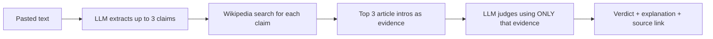

# 🔍 Claim Checker

> Paste a paragraph. Get its factual claims fact-checked, with receipts.


Claim Checker takes any block of text, pulls out the factual claims, searches Wikipedia for evidence, and gives each claim a verdict (**Supported**, **Contradicted**, or **Not enough info**) with a short explanation and a link to the source article.


---

## ✨ Features

- **Claim extraction**: an LLM picks out up to 3 specific, checkable claims and ignores opinions.
- **Evidence retrieval**: each claim triggers a Wikipedia search; the intros of the top 3 articles become the evidence.
- **Evidence-only verdicts**: the LLM must judge using *only* the retrieved text, not its own memory.
- **Honest "I don't know"**: if the evidence doesn't settle a claim, the app says `NOT_ENOUGH_INFO` instead of guessing.
- **Cited sources**: every verdict links to the Wikipedia article it relied on.
- **Measured accuracy**: a hand-labeled test set and an evaluation script report real numbers (see [Evaluation](#-evaluation)).
- **Simple stack**: Python, FastAPI, and one plain HTML file. No build tools.

---

## 🧠 How it works



### Design decisions

| Decision | Why |
|---|---|
| Ground answers in retrieved evidence | An LLM judging from memory can sound confident and be wrong. Retrieval makes the answer checkable. |
| Three verdicts, including `NOT_ENOUGH_INFO` | A fact-checker that can say "I can't tell" is more trustworthy than one that always picks a side. |
| LLM replies in strict JSON | Code can't reliably parse free-form sentences. A small parser also handles stray text around the JSON. |
| `temperature=0` | More consistent verdicts for the same input. |
| Plain HTML frontend served by FastAPI | One command to run, no CORS setup, easy to read and explain. |
| Model name kept in one variable (`MODEL`) | Providers retire models. Switching should be a one-line change. |

---

## 🧰 Tech stack

| Part | Tool |
|---|---|
| Backend | Python, FastAPI, Uvicorn |
| LLM | Groq API (`openai/gpt-oss-120b`) |
| Evidence | Wikipedia API (via `requests`) |
| Frontend | HTML, CSS, vanilla JavaScript, Google Fonts |
| Config | `python-dotenv` |

---

## 🚀 Run it locally

**Requirements:** Python 3.9+ and a free Groq API key from [console.groq.com/keys](https://console.groq.com/keys).

```bash
# 1. Clone the repo
git clone https://github.com/YOUR-USERNAME/claim-checker.git
cd claim-checker

# 2. Create and activate a virtual environment
python -m venv venv
# Windows:
venv\Scripts\activate
# Mac/Linux:
source venv/bin/activate

# 3. Install dependencies
pip install -r requirements.txt
```

**4. Add your API key.** Copy `.env.example` to a new file named `.env` and put your real key in it:

```
GROQ_API_KEY=your-groq-key-here
```

**5. Start the server:**

```bash
uvicorn main:app --reload
```

Open **http://127.0.0.1:8000**, paste some text, and click **Check claims**.

> **If you get a "model not found" error:** providers retire models over time. Run `python list_models.py` to see what your key can use, then change the `MODEL` line near the top of `main.py`.

---

## 📊 Evaluation

I measured the checker instead of just eyeballing it.

- **Test set:** `test_claims.json` has 30 hand-labeled claims: 12 true, 12 false, and 6 that Wikipedia can't settle (opinions, predictions, made-up trivia).
- **Script:** `python evaluate.py` runs the real search and verdict code on every claim, then prints overall accuracy, accuracy per claim type, a confusion table, and every mistake. Full output is saved to `results.csv`.

| Version | What changed | Accuracy |
|---|---|---|
| Baseline | First working version | XX% |
| v2 | XX | XX% |
| v3 | XX | XX% |

**What the evaluation does and doesn't cover**

- It measures the **evidence search + verdict** stages. Search queries are hand-written, so the claim-extraction stage is not scored.
- 30 claims is a small sample, so treat the accuracy as a rough estimate.
- Many test claims are about well-known topics. Accuracy on obscure or very recent topics is likely lower.
- LLM output can vary slightly between runs.

---

## 📁 Project structure

```
claim-checker/
├── main.py            # FastAPI backend: claim extraction, Wikipedia search, verdicts
├── index.html         # Frontend (HTML + CSS + JS in one file)
├── evaluate.py        # Runs the test set and reports accuracy
├── test_claims.json   # 30 hand-labeled claims
├── list_models.py     # Lists the Groq models your key can use
├── requirements.txt   # Python dependencies
├── .env.example       # Template for your API key (copy to .env)
├── results.csv        # Latest evaluation output
└── docs/
    └── screenshot.png # Screenshot used in this README
```

---

## ⚠️ Limitations

- Only the **introduction** of each Wikipedia article is used, so a fact that appears deeper in an article may come back as `NOT_ENOUGH_INFO`.
- Wikipedia is the only source, and it isn't perfect. Very recent events may not be covered yet.
- The LLM can still misjudge the evidence. Treat verdicts as a starting point, not the final truth.
- Input is limited to 3000 characters and up to 3 claims per check.
- The Groq free tier has rate limits, which may change over time.

This is a learning and portfolio project, not a production fact-checking service.

---

## 🛣️ Ideas for next steps

- Score the claim-extraction stage too, not just search and verdicts.
- Use more of each article (chunking) instead of only the intro.
- Add more evidence sources beyond Wikipedia.
- Benchmark against a public fact-verification dataset such as FEVER.
- Cache Wikipedia results to speed up repeat checks.

---

## 🌱 The journey: from Resume Screener to Claim Checker

This project is the next step after my [AI Resume Screener](https://github.com/YOUR-USERNAME/YOUR-RESUME-SCREENER-REPO), where I extended a CLI-based Python project into a full-stack app with a FastAPI backend and a web frontend.

Claim Checker pushes further on the question *"how do you make an LLM's output trustworthy?"*:

| Resume Screener | Claim Checker |
|---|---|
| Built the full-stack foundation (FastAPI + web UI) | Reuses that foundation and adds a real pipeline behind it |
| LLM output for a single task | **Retrieval-grounded** answers with cited sources |
| Looked at results manually | **Hand-labeled test set** and an evaluation script with real metrics |
| One model, assumed stable | Handled a **retired model**, free-tier limits, and strict JSON output |

---

## 👤 Author

Built by **Ayush**, student preparing for AI and software engineering roles.

- LinkedIn: linkedin.com/in/ayush-jha-68831231a/
- GitHub: https://github.com/ayushjha4002-glitch

If you found this useful, a ⭐ on the repo is appreciated, and feedback is welcome in the issues tab.
